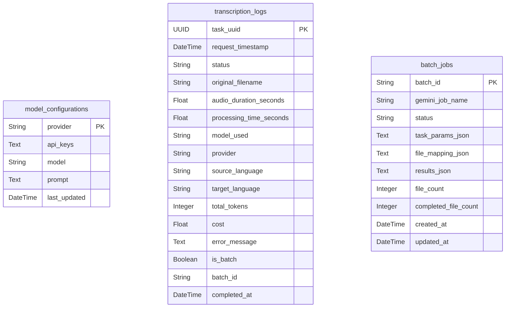

# AI Voice Transcription — 系統架構說明書 (SAD)

> **版本**: 1.0 | **日期**: 2026-03-05 | **專案名稱**: AI_translate

---

# 第一章：系統整體架構與 API 規範

## 1.1 專案概述

本專案是一套 **AI 語音轉錄與翻譯系統**，使用者可上傳音訊/影片檔案或 YouTube 連結，透過 Google Gemini AI 模型將語音轉錄為帶時間戳的字幕檔（LRC/SRT/VTT/TXT），並可選擇翻譯成其他語言。系統支援**一般模式**（即時逐檔處理）和**批次模式**（Gemini Batch API，費用降 50%）。

## 1.2 技術棧總覽

| 層級 | 技術 | 說明 |
|------|------|------|
| **前端** | React 18 + Vite 5 | SPA 應用程式 |
| **UI 框架** | Ant Design 5 | 元件庫 |
| **HTTP 請求** | Axios / Fetch API | 前後端通訊 |
| **即時通訊** | WebSocket | 任務進度即時推播 |
| **後端 API** | FastAPI (Python) | RESTful + WebSocket 端點 |
| **任務佇列** | Celery | 非同步任務處理 |
| **訊息中介** | Redis | Celery Broker + Pub/Sub |
| **資料庫** | PostgreSQL 13 | 持久化儲存 |
| **ORM** | SQLAlchemy | 資料庫操作 |
| **AI 模型** | Google Gemini API | 語音轉錄核心 |
| **音訊處理** | ffmpeg / ffprobe | 格式轉換與時長分析 |
| **語音活動偵測** | Silero VAD | 靜音移除 |
| **容器化** | Docker Compose | 開發/生產環境部署 |

## 1.3 系統架構圖

```
┌─────────────────────────────────────────────────────────────────┐
│                         使用者瀏覽器                             │
│  ┌───────────┐  ┌──────────────┐  ┌───────────┐               │
│  │ 語音轉錄頁 │  │  歷史紀錄頁   │  │ 模型管理  │               │
│  └─────┬─────┘  └──────┬───────┘  └─────┬─────┘               │
│        │ WebSocket      │ REST API       │ REST API            │
└────────┼───────────────┼───────────────┼───────────────────────┘
         │               │               │
         ▼               ▼               ▼
┌─────────────────────────────────────────────────────────────────┐
│                     FastAPI 後端 (:8000)                        │
│  ┌──────────┐ ┌────────┐ ┌─────────────┐ ┌───────┐ ┌───────┐ │
│  │ /ws/{uid}│ │/upload │ │/setting/*   │ │/batch │ │/history│ │
│  └────┬─────┘ └───┬────┘ └──────┬──────┘ └──┬────┘ └──┬────┘ │
│       │           │             │           │          │       │
│       ▼           │             ▼           │          ▼       │
│  WebSocket        │       ModelSettings     │     HistoryRepo  │
│  Manager ◄────── Redis Pub/Sub ──────────►  │          │       │
└───────┼───────────┼─────────────────────────┼──────────┼───────┘
        │           │                         │          │
        ▼           ▼                         ▼          ▼
┌───────────────────────────────────────────────────────────────┐
│                      Celery Worker                           │
│  ┌─────────────────────┐  ┌─────────────────────────────┐   │
│  │ transcribe_media    │  │ batch_transcribe_task        │   │
│  │   ├ VAD 靜音移除     │  │   ├ 批次上傳 Gemini File API │   │
│  │   ├ Gemini 轉錄     │  │   ├ Batch API 建立任務       │   │
│  │   ├ 格式轉換        │  │   ├ 輪詢直到完成              │   │
│  │   └ 費用計算        │  │   └ 逐一處理結果              │   │
│  └─────────────────────┘  └─────────────────────────────────┘ │
└───────────────────────────┬───────────────────────────────────┘
                            ▼
              ┌──────────────────────────┐
              │     PostgreSQL 資料庫     │
              │  ├ model_configurations  │
              │  ├ transcription_logs    │
              │  └ batch_jobs            │
              └──────────────────────────┘
```

## 1.4 API 端點規範

| 方法 | 路徑 | 說明 |
|------|------|------|
| `POST` | `/api/v1/upload` | 上傳音訊/影片檔案至臨時目錄 |
| `WS` | `/api/v1/ws/{file_uid}` | 單檔轉錄 WebSocket（接收任務、推播進度） |
| `WS` | `/api/v1/batch/ws/{batch_id}` | 批次轉錄 WebSocket |
| `GET` | `/api/v1/batch/pending` | 查詢未完成的批次任務 |
| `POST` | `/api/v1/batch/{batch_id}/recover` | 恢復批次任務結果 |
| `POST` | `/api/v1/setting/models` | 儲存服務商設定（API Key、模型、Prompt） |
| `GET` | `/api/v1/setting/models/{provider}` | 取得服務商設定 |
| `POST` | `/api/v1/setting/test` | 測試 API 連線 |
| `GET` | `/api/v1/setting/default-prompt` | 取得預設 Prompt 模板 |
| `GET` | `/api/v1/history` | 分頁查詢歷史紀錄（支援篩選/搜尋） |
| `GET` | `/api/v1/history/stats` | 歷史統計總覽 |
| `GET` | `/api/v1/history/{task_uuid}` | 單筆紀錄詳情 |
| `DELETE` | `/api/v1/history/{task_uuid}` | 刪除單筆紀錄 |

## 1.5 前後端通訊流程

### 1.5.1 一般模式完整流程

```
使用者                    前端                          後端 API              Celery Worker          Gemini API
 │                        │                             │                      │                      │
 │── 上傳音訊檔案 ──────►│                             │                      │                      │
 │                        │── POST /api/v1/upload ────►│                      │                      │
 │                        │◄── { filename } ──────────│                      │                      │
 │                        │                             │                      │                      │
 │── 按下「開始轉錄」───►│                             │                      │                      │
 │                        │── WS /api/v1/ws/{file_uid}─►│                      │                      │
 │                        │── send(JSON payload) ──────►│                      │                      │
 │                        │                             │── Celery delay() ──►│                      │
 │                        │                             │                      │── 上傳檔案 ──────────►│
 │                        │                             │                      │── 轉錄請求 ──────────►│
 │                        │                             │                      │◄── LRC 結果 ─────────│
 │                        │                             │                      │── 格式轉換 + 費用計算  │
 │                        │                             │                      │── Redis Pub ─────────►│
 │                        │◄── WS 進度更新 ─────────────│◄── Redis Sub ────────│                      │
 │◄── 即時顯示進度 ──────│                             │                      │                      │
 │                        │◄── WS COMPLETED + result ──│                      │                      │
 │◄── 顯示結果/下載 ─────│                             │                      │                      │
```

### 1.5.2 批次模式完整流程

1. **上傳階段**：逐一 `POST /api/v1/upload` 上傳所有檔案
2. **提交階段**：建立 `WS /api/v1/batch/ws/{batch_id}` 連線，發送含所有檔案的 JSON
3. **Celery Worker**：
   - VAD 前處理所有檔案 → 上傳至 Gemini File API
   - 呼叫 `create_batch_transcription_job()` 建立 Batch API 任務
   - 在 DB (`batch_jobs` 表) 持久化任務資訊
   - 發送 `BATCH_SUBMITTED` 狀態（前端此時釋放 UI）
   - 輪詢 Gemini Batch API 直到完成
   - 逐一處理結果，格式轉換、費用計算、寫入 DB
4. **恢復機制**：頁面載入時 `GET /api/v1/batch/pending` 檢查未完成任務，可 `POST /batch/{id}/recover` 恢復結果

### 1.5.3 WebSocket + Redis Pub/Sub 機制

```
Celery Worker ──Redis PUBLISH "transcription_updates"──► Redis Server
                                                            │
FastAPI (main.py lifespan) ── 啟動背景 Task ──────────────────┘
                                                            │
WebSocket Manager ── redis_listener() ── SUBSCRIBE ─────────┘
    │
    └── send_personal_message(data, client_id) ──► 前端 WebSocket
```

- `ConnectionManager` 維護 `{client_id: WebSocket}` 映射表
- Celery Worker 透過 `redis_client.publish()` 發送狀態更新
- FastAPI 啟動時建立 `asyncio.create_task(manager.redis_listener())`
- Redis 監聽器收到訊息後，根據 `client_id` 轉發到對應的 WebSocket 連線

## 1.6 部署架構 (Docker Compose)

```yaml
# docker-compose.dev.yml — 5 個容器
services:
  postgres:        # PostgreSQL 13 (port: 5432)
  redis:           # Redis 6 (Celery Broker + Pub/Sub)
  backend-service: # FastAPI + uvicorn --reload (port: 8000)
  celery-worker:   # Celery Worker
  frontend-dev:    # Vite dev server + HMR (port: 5173)
```

**環境變數**透過 `.env.prod` 統一管理，包含 PostgreSQL 帳密、Redis 連線等。前端透過 Vite 的 proxy 將 `/api/v1` 轉發到 `backend-service:8000`。

---

# 第二章：資料庫與後端架構

## 2.1 後端專案結構

```
backend/
├── main.py                    # FastAPI 應用程式入口
├── requirements.txt           # Python 依賴
├── app/
│   ├── api/                   # API 路由層
│   │   ├── transcription.py   # WebSocket 轉錄端點
│   │   ├── upload.py          # 檔案上傳 REST API
│   │   ├── model_manager.py   # 模型設定 CRUD + API 測試
│   │   ├── batch.py           # 批次轉錄 WebSocket + 恢復 API
│   │   └── history.py         # 歷史紀錄查詢/統計/刪除
│   ├── celery/                # 非同步任務
│   │   ├── celery.py          # Celery 實例設定
│   │   ├── models.py          # 任務參數 Pydantic 模型
│   │   ├── task.py            # 單檔轉錄任務
│   │   └── batch_task.py      # 批次轉錄任務 + 恢復任務
│   ├── core/                  # 核心設定
│   │   ├── config.py          # 集中式設定管理 (Pydantic Settings)
│   │   └── default_prompt.py  # Prompt 模板 (Single Source of Truth)
│   ├── database/              # 資料庫層
│   │   ├── models.py          # SQLAlchemy ORM 模型
│   │   └── session.py         # Engine/Session + 自動遷移
│   ├── repositories/          # 資料存取層
│   │   ├── model_manager_repository.py
│   │   ├── transcription_log_repository.py
│   │   ├── history_repository.py
│   │   └── batch_job_repository.py
│   ├── schemas/               # Pydantic 請求/回應模型
│   │   └── schemas.py
│   ├── services/              # 業務邏輯層
│   │   ├── transcription/     # 轉錄流程 (VAD → 轉錄 → 重映射)
│   │   ├── converter/         # 格式轉換 (LRC → SRT/VTT/TXT)
│   │   ├── calculator/        # 費用計算
│   │   ├── vad/               # 語音活動偵測 (Silero VAD)
│   │   └── translator/        # 翻譯服務
│   ├── provider/              # 外部 AI 提供者
│   │   └── google/gemini.py   # Gemini Client + Batch API
│   ├── utils/                 # 工具函式
│   │   ├── audio.py           # ffmpeg/ffprobe 音訊處理
│   │   └── logger.py          # 統一日誌設定
│   └── websocket/
│       └── manager.py         # WebSocket 連線管理 + Redis 監聽
```

## 2.2 資料庫設計

### 2.2.1 ER 圖



### 2.2.2 資料表說明

| 資料表 | 用途 | 主鍵 |
|--------|------|------|
| `model_configurations` | 儲存各服務商的 API Key、模型、Prompt 設定 | `provider` |
| `transcription_logs` | 每次轉錄任務的完整紀錄（狀態、費用、token 用量等） | `task_uuid` |
| `batch_jobs` | 持久化 Gemini 批次任務資訊，供中斷後恢復 | `batch_id` |

**`batch_jobs.status` 狀態流轉**：`UPLOADING` → `POLLING` → `BATCH_SUBMITTED` → `COMPLETED` / `FAILED` → `RETRIEVED` / `RECOVERING`

### 2.2.3 自動遷移機制

`session.py` 中的 `_migrate_add_missing_columns()` 會在應用啟動時自動比對 ORM 模型與實際資料表，對缺少的欄位執行 `ALTER TABLE ADD COLUMN`，無需手動維護遷移腳本。

### 2.2.4 初始化與預設資料

`init_db()` 於應用啟動時呼叫，會自動建表並插入預設服務商記錄 (`Google`, `Anthropic`, `OpenAI`)。

## 2.3 API 路由層詳解

### 2.3.1 檔案上傳 (`upload.py`)

- **端點**：`POST /api/v1/upload`
- **接收**：`multipart/form-data` 音訊/影片檔案
- **驗證**：MIME 類型白名單（支援 wav/mp3/flac/opus/m4a/mp4/webm 等）
- **處理**：儲存至 `temp_uploads/` 目錄，同名自動編號避免覆蓋
- **回傳**：`{ filename: "saved_name.mp3" }`

### 2.3.2 轉錄 WebSocket (`transcription.py`)

- **端點**：`WS /api/v1/ws/{file_uid}`
- **流程**：接受連線 → 接收 JSON payload → 在執行緒中啟動 Celery 任務 → 保持連線等待結果
- **Payload 結構** (`WebSocketTranscriptionRequest`)：
  - `filename`, `original_filename`, `provider`, `model`, `api_keys`
  - `source_lang`, `target_lang`, `prompt`, `original_text`, `multi_speaker`

### 2.3.3 模型設定 (`model_manager.py`)

- `POST /api/v1/setting/models`：儲存服務商設定（API Keys JSON 序列化後存入 DB）
- `GET /api/v1/setting/models/{provider}`：取得設定（API Keys 反序列化為陣列回傳）
- `POST /api/v1/setting/test`：測試 Gemini API 連線（列出可用模型驗證金鑰有效性）
- `GET /api/v1/setting/default-prompt`：回傳系統預設 Prompt 模板與語言對照表

### 2.3.4 批次轉錄 (`batch.py`)

- `WS /api/v1/batch/ws/{batch_id}`：批次轉錄 WebSocket（與單檔類似但傳送多個檔案）
- `GET /api/v1/batch/pending`：查詢 `batch_jobs` 中未完成的任務
- `POST /api/v1/batch/{batch_id}/recover`：恢復結果（DB 快速路徑 or Celery 從 Gemini 取回）

### 2.3.5 歷史紀錄 (`history.py`)

- `GET /api/v1/history`：分頁查詢（支援 status / is_batch / keyword 篩選）
- `GET /api/v1/history/stats`：統計（總任務數、成功率、總費用、平均處理時間等）
- `GET /api/v1/history/{task_uuid}`：單筆詳情
- `DELETE /api/v1/history/{task_uuid}`：刪除紀錄

## 2.4 Celery 任務處理流程

### 2.4.1 單檔轉錄 (`task.py` — `transcribe_media_task`)

| 步驟 | 動作 | 說明 |
|------|------|------|
| 1 | 建立日誌 | 在 `transcription_logs` 插入 `PROCESSING` 紀錄 |
| 2 | 分析音訊 | ffprobe 取得音檔時長 |
| 3 | 初始化 Client | 使用使用者 API Key 建立 `GeminiClient` |
| 4 | 組裝 Prompt | 根據語言/多人/翻譯/自訂模板動態組裝 |
| 5 | VAD 前處理 | Silero VAD 移除靜音段，提取純語音 |
| 6 | 上傳 Gemini | 音訊上傳至 Gemini File API |
| 7 | AI 轉錄 | `generate_content()` 產生 LRC 結果 |
| 8 | 時間戳重映射 | VAD 處理後的時間軸映射回原始時間軸 |
| 9 | 格式轉換 | LRC → SRT / VTT / TXT |
| 10 | 費用計算 | 根據模型定價計算 input/output token 費用 |
| 11 | 更新 DB | 狀態 → `COMPLETED`，寫入指標 |
| 12 | 發布結果 | Redis Pub/Sub → WebSocket → 前端 |

### 2.4.2 批次轉錄 (`batch_task.py` — `batch_transcribe_task`)

1. VAD 前處理所有檔案（語音佔比 ≥ 95% 則跳過）
2. 逐一上傳至 Gemini File API
3. 建立 Batch API inline requests → `create_batch_transcription_job()`
4. 持久化至 `batch_jobs` 表（含 `gemini_job_name`、`file_mapping_json`）
5. 發送 `BATCH_SUBMITTED`（前端 UI 釋放）
6. 輪詢 `poll_batch_job_status()` 直到 `JOB_STATE_SUCCEEDED`
7. 逐一處理結果（格式轉換、翻譯、費用計算 × 50% 折扣）
8. 結果寫入 `batch_jobs.results_json` + 更新 `transcription_logs`

### 2.4.3 批次恢復 (`batch_task.py` — `batch_recover_task`)

用於應用重啟後從 Gemini 取回已完成批次的結果，透過 `batches.get()` API 取得並存入 DB。

## 2.5 服務層詳解

| 服務 | 位置 | 功能 |
|------|------|------|
| **TranscriptionTask** | `services/transcription/flows.py` | 轉錄主流程：VAD → Gemini 轉錄 → 時間戳重映射 → 分割重試 |
| **ConverterService** | `services/converter/service.py` | LRC 解析 → SRT / VTT / TXT 格式轉換 |
| **CalculatorService** | `services/calculator/service.py` | 根據模型定價計算 input/output token 費用 |
| **VAD Service** | `services/vad/service.py` | Silero VAD 語音活動偵測，移除靜音段 |
| **GeminiClient** | `provider/google/gemini.py` | Gemini API 封裝：上傳/轉錄/翻譯/批次任務/連線測試 |

## 2.6 核心設定 (`core/config.py`)

使用 `pydantic-settings` 的 `BaseSettings`，支援三級優先序：**環境變數 > .env 檔案 > 預設值**。

| 設定項 | 預設值 | 說明 |
|--------|--------|------|
| `postgres_server` | `localhost` | PostgreSQL 主機 |
| `postgres_port` | `5432` | PostgreSQL 埠 |
| `redis_host` / `redis_port` | `localhost:6379` | Redis 連線 |
| `celery_timezone` | `Asia/Taipei` | Celery 時區 |
| `celery_result_expires` | `86400` | 任務結果過期秒數 |
| `temp_uploads_dir` | `temp_uploads` | 暫存目錄 |

## 2.7 Prompt 模板系統 (`core/default_prompt.py`)

系統使用 **Single Source of Truth** 的 Prompt 模板，`build_prompt()` 根據參數動態組裝：

- **`{source_lang}`**：音訊語言名稱（zh-TW → 繁體中文, ja-JP → 日文, en-US → 英文）
- **`{speaker_instruction}`**：多人模式時插入 Speaker 標籤指令
- **`{translate_instruction}`**：有翻譯目標時插入翻譯指令（自動編號第 6 或第 7 條）

---

# 第三章：前端 UI 狀態與元件架構

## 3.1 前端專案結構

```
frontend/src/
├── main.jsx                          # 應用程式入口 (ReactDOM.createRoot)
├── App.jsx                           # 根元件 + 頂部導航選單
├── index.css                         # 全域樣式
├── constants/
│   └── modelConfig.js                # AI 模型/服務商定義
├── context/
│   └── TranscriptionContext.jsx      # 全域狀態管理 (776 行核心)
└── components/
    ├── Transcription.jsx             # 轉錄設定頁面
    ├── FileManager.jsx               # 檔案上傳與管理元件
    ├── ModelManager.jsx              # API 金鑰與參數管理 (Context Provider)
    ├── History.jsx                   # 歷史紀錄頁面
    └── Transcription/
        ├── UploadArea.jsx            # 拖拽上傳區域
        ├── FileQueueHeader.jsx       # 佇列操作列
        ├── FileQueueTable.jsx        # 檔案佇列表格
        └── QueueSummary.jsx          # 處理結果摘要
```

## 3.2 元件樹與 Context 架構

```
<React.StrictMode>
  <App>
    <ModelManagerProvider>              ← 提供 API 金鑰/Prompt 管理功能
      <TranscriptionProvider>           ← 提供檔案列表/轉錄流程/WebSocket
        <Layout>
          <Header>
            <Menu>                      ← 語音轉錄 | 歷史紀錄
          </Header>
          <Content>
            ├─ <Transcription />        ← activeKey === 'transcription'
            │   ├─ <FileManager />
            │   │   ├─ <UploadArea />
            │   │   ├─ <FileQueueHeader />
            │   │   ├─ <FileQueueTable />
            │   │   └─ <QueueSummary />
            │   ├─ 轉錄設定 Card
            │   └─ 開始轉錄 Card
            └─ <History />              ← activeKey === 'history'
          </Content>
        </Layout>
      </TranscriptionProvider>
      <Modal 編輯API />                 ← ModelManagerProvider 內部渲染
      <Modal 編輯參數 />
    </ModelManagerProvider>
  </App>
</React.StrictMode>
```

## 3.3 頁面功能詳解

### 3.3.1 語音轉錄頁

| 功能區塊 | 元件 | 說明 |
|----------|------|------|
| **1. 上傳與管理** | `FileManager` | 拖拽上傳音訊檔、貼上 YouTube 連結、附加原始文字稿 |
| **上傳區域** | `UploadArea` | 無檔案時顯示拖拽上傳區域 |
| **佇列操作** | `FileQueueHeader` | 追加更多檔案、清除所有 |
| **檔案表格** | `FileQueueTable` | 顯示檔名、狀態進度、操作按鈕（下載/預覽/重試/附加文字/刪除） |
| **處理摘要** | `QueueSummary` | 已完成數量、總 token、總費用（含 input/output 拆分） |
| **2. 轉錄設定** | `Transcription` | 服務商 → 模型 → 音訊語言 → 翻譯目標，編輯 API/參數/測試按鈕 |
| **3. 開始轉錄** | `Transcription` | 批次模式開關（-50% 費用）、多人模式開關、一鍵轉錄 |

### 3.3.2 歷史紀錄頁

| 功能區塊 | 說明 |
|----------|------|
| **統計卡片** | 總任務數、成功率、總費用、平均處理時間 |
| **篩選列** | 關鍵字搜尋、狀態篩選 (成功/失敗/處理中)、模式篩選 (批次/一般) |
| **資料表格** | 檔名、狀態 Tag、模式 Tag、開始時間、處理耗時、費用、模型、刪除操作 |
| **展開詳情** | 任務 ID、模型、服務商、語言、翻譯目標、Token 用量、音檔長度、批次 ID、錯誤訊息 |
| **分頁** | 支援 10/15/20/50 筆每頁，顯示總筆數 |

## 3.4 狀態管理詳解

### 3.4.1 TranscriptionContext

**核心狀態**：

| 狀態 | 類型 | 說明 |
|------|------|------|
| `fileList` | `Array<File>` | 檔案佇列，每個檔案含 `uid, name, status, percent, statusText, result, tokens_used, cost` 等 |
| `model` | `string` | 選中的 AI 模型 (預設 `gemini-3.1-pro-preview`) |
| `targetLang` | `string` | 音訊語言 (預設 `zh-TW`) |
| `targetTranslateLang` | `string\|null` | 翻譯目標語言 (null = 不翻譯) |
| `useBatchMode` | `boolean` | 是否使用批次模式 |
| `multiSpeaker` | `boolean` | 是否啟用多人模式 |
| `isProcessing` | `boolean` | 是否正在處理中 |
| `pendingBatches` | `Array` | 載入時檢查到的未完成批次任務 |
| `activeSockets` | `Ref<Object>` | 管理所有活躍 WebSocket 連線 |

**檔案狀態流轉**：

```
waiting ──► processing ──► completed
                │               
                ├──► error (可重試 → waiting)
                │
                └──► batch_pending (批次模式提交後)
```

**提供的核心方法**：

| 方法 | 說明 |
|------|------|
| `handleStartTranscription()` | 根據 `useBatchMode` 分流至一般/批次處理 |
| `handleRegularTranscription()` | 逐一上傳檔案 → 建立 WebSocket → Celery 轉錄 |
| `handleBatchTranscription()` | 全部上傳 → 單一 Batch WebSocket → Gemini Batch API |
| `recoverBatch(batchId)` | 恢復未完成批次（輪詢最多 5 分鐘） |
| `downloadFile(content, name, format)` | 單檔下載 |
| `downloadAllFiles(format)` | ZIP 打包下載所有已完成檔案 |
| `handleReprocess(uid)` | 重置檔案狀態為 `waiting` 以便重新處理 |
| `clearAllFiles()` | 關閉所有 WebSocket 連線並清空佇列 |

### 3.4.2 ModelManagerProvider

**三級快取策略**（`getProviderConfig()`）：

```
1. 記憶體快取 (React state)     → 命中直接返回
2. localStorage                → 命中後同步至記憶體
3. 後端 API (GET /setting/models/{provider}) → 命中後同步至 localStorage + 記憶體
```

**統一儲存流程**（`saveProviderConfig()`）：

```
前端呼叫 → POST /api/v1/setting/models → 後端 DB 儲存
         → localStorage 備份
         → React state 更新
```

**提供的核心方法**：

| 方法 | 說明 |
|------|------|
| `handleEditProvider(provider)` | 開啟編輯 API 金鑰 Modal |
| `handleEditProviderParams(provider)` | 開啟編輯 Prompt Modal（無設定時從後端取預設模板） |
| `handleTestProvider(provider)` | 呼叫 `POST /api/v1/setting/test` 測試 API 連線 |
| `getProviderConfig(provider)` | 三級快取取得設定 |

## 3.5 模型配置 (`modelConfig.js`)

```javascript
export const modelOptions = {
  Google: [
    { value: 'gemini-3.1-pro-preview', label: 'gemini-3.1-pro-preview' },
    { value: 'gemini-2.5-flash',     label: 'gemini-2.5-flash' },
    { value: 'gemini-2.5-pro',       label: 'gemini-2.5-pro' }
  ]
  // Anthropic, OpenAI: 已預留但尚未啟用
};

// findProviderForModel(model) → 根據模型名稱反查服務商
```

## 3.6 資料流總結

```
使用者選擇檔案 → 前端上傳到 temp_uploads/
    → 建立 WebSocket 連線
    → 傳送轉錄參數 (模型、語言、API Key、Prompt)
    → FastAPI 將任務派送至 Celery
    → Celery Worker: VAD → Gemini 轉錄 → 格式轉換 → 費用計算
    → 結果寫入 PostgreSQL (transcription_logs)
    → 透過 Redis Pub/Sub → WebSocket → 前端即時更新
    → 使用者下載字幕檔 (LRC/SRT/VTT/TXT)
```
